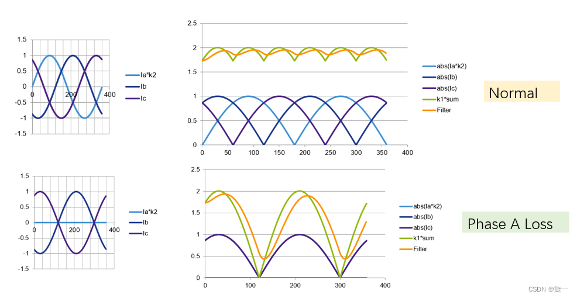
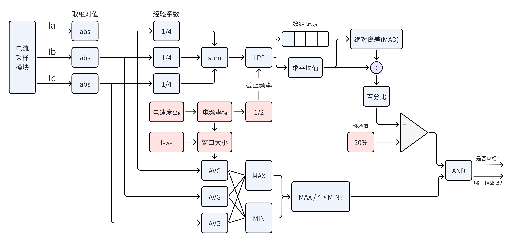

## 自适应缺相检测算法

### 前言

感谢来自 CSDN @旋一 的参考文献：https://blog.csdn.net/amonghappyer/article/details/136825518

在原文中，作者介绍了正常状态下三相电流的绝对值之和为馒头波，以及通过判断馒头波的幅值来分辨是否缺相的方法。然而，在实测中，该方法的检测精度和准确度非常依赖以下因素：

- `I_sum` 的低通滤波截止频率
- 对 `I_a` / `I_b` / `I_c` 的滑动平均滤波窗口长度
- 整体的采样点数，即采样窗口长度

对这几个参数，作者并没有直接给出判断方法，且一组固定参数显然无法覆盖全速域，导致低速时容易误报，而高速运行时的缺相由于窗口过长而无法被检出。因此，在原文基础上，本文提出一种基于当前电速度自适应决定窗口长度和截止频率的方法，需要调节的参数仅有一个百分比阈值（经过实测完全可以不调节），就可以在电机运行的全速域有效检测到缺相故障，并且上报具体是哪一相发生故障。

本方法对有感 / 无感 FOC 和单、双、三路电流采样方法均适用。

### 检测原理

传统方法一般是直接分别检测三相电流的绝对值经过低通后是否持续一段时间小于阈值，但这个阈值、持续时间等等都需要实测，不仅很难调试而且容易误报。

引用一张缺相检测的原理图：

可以看到在正常运行（且有电流流过绕组）的情况下，由于基尔霍夫电流定律， `Ia + Ib + Ic = 0`，因此三相电流绝对值之和不存在为 0 的情况，如绿色馒头波所示。

在 A 相缺相的情况下，流经 A 相的电流为 0，则`Ib + Ic = 0`。若当前电机仍然处于旋转中（代表存在换相），此时其绝对值之和必然存在一个为 0 的时间，导致波形的幅值急剧放大，由此可以检测出发生缺相。此方法通过对比三相电流的绝对值，还可以得出是哪相发生了缺相故障。

本方法通过计算平均绝对离差（*Mean Absolute Deviation*，MAD）提取出三相电流绝对值之和的幅值，然后检测该幅值与三相电流绝对值之和的平均值之比。这个百分比的阈值经过测试并不会随着不同电机、不同工况而大幅度波动，并且由于缺相时幅值急剧放大，因此除了电流极小的工况（这种情况下缺相也不会造成很大的影响），这个方法能够在大部分情况下把缺相故障和正常故障明确的区分出来。

可以看出，幅值提取的准确性与选取的窗口长度密切相关。如果窗口长度短于一个电周期的长度，则很容易提取出错误的幅值；如果选取一个固定的长窗口，则一方面影响故障保护的响应速度，一方面记录如此长的波形也会占用不必要的计算资源。

### 算法框图

记 PWM 频率（一般也与电流环路控制频率相等）为 `f_pwm`，检测算法运行在电流环路中，则通过编码器或无感观测器得到的电速度可以得到电频率 `f_e`，我们选取一个电周期为采样窗口，此时需要先判定电频率范围，我们只在电频率大于 1Hz 且小于 PWM 频率的一半（根据采样定律）时才使能检测。

1. **计算`I_sum`的低通截止频率**：根据采样定律，取 `f_e`的一半为截止频率，方便过滤电流的高频噪声。
2. **`I_a` / `I_b` / `I_c` 的滑动平均滤波窗口长度**：计算出窗口长度为 `window_size = f_pwm / f_e`。
3. **整体的采样点数，即采样窗口长度**：对于不同长度的电周期窗口，我们不可能对每个采样点都记录低通后的样本点。本方法设置了一个长度上限为 100 点的数组，前面计算的 `window_size = sample_point_size`，则需要计算插值点 `interp_idx = sample_point_size / 100`（不足 1 补 1），隔 n 次采样再记录一次样本。

计算出三相电流绝对值之和的平均绝对离差后，除以其平均值，与固定值相比较得到判据 1，为了避免前文提到的电流极小情况，对 `I_a` / `I_b` / `I_c` 滑动滤波后求出极值，判断最大值的 1/4 是否仍大于最小值（且电流最小值对应的相就是缺的那一相），此为判据 2。最后，将这两种判据相与，得到最终的缺相情况。

该方法已经实现在 [iFOC](https://github.com/Matrixchung/iFOC) 系统中，在有感平台（ME7010 云台电机、GIM6010-8、-48、DM4310 关节电机）以及通过高频注入 + 滑膜观测器驱动的无感平台（暴风EDF 70mm 涵道电机）上测试通过。

### 代码参考

请移步该 [commit](https://github.com/Matrixchung/iFOC/commit/b622a883edfd2627d398a129a9c44a4441931b22)，主要逻辑代码在 [foc_task_update_sense.cpp](https://github.com/Matrixchung/iFOC/blob/b622a883edfd2627d398a129a9c44a4441931b22/src/Motor/FOC/Task/foc_task_update_sense.cpp#L26-L158) 中。