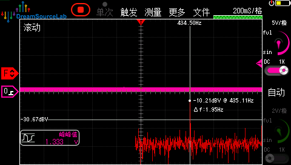
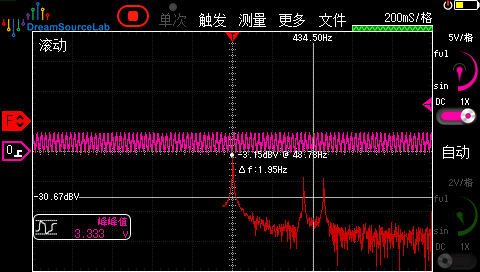

## Test Environment
* DreamSourceLab DS4T1012 150M 1GSa/s Oscilloscope
* Using iFOC-GIM6010 v2.0 25/04 version hardware
* Test DAC output on DAC1
* Inject frequency: Flux linkage detection in `foc_task_basic_param_calib.cpp`, target cruise speed: 96pi rad/s, 
we inject 9th multiple frequency (2714.336 rad/s = 432 Hz) to virtual d-axis. Note that WaveInjector receives Hz or seconds as input parameter.
* Inject amplitude: -1A constant Id offset + 0.5A sine wave

## FFT Test Result
1) DAC output set to dq-axis current: (now we expect peaks at 9th 432Hz, base frequency peak is filtered)

    

2) DAC output set to phase current: (9th harmonic current in dq-axis -> 8th & 10th harmonic current in phase current)

    